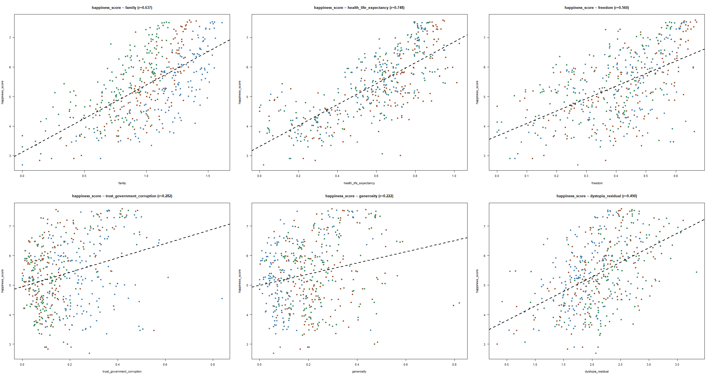

# Data Analytics Discord 
## Exercise 1: World Happiness 

I found a lively "data analytics" discord channel on Reddit and apparently this is what I'm doing with my free time under quarantine.  The first exercise is [here](https://colab.research.google.com/drive/1HVr1d-yg-Z4Dj5x9BLnv-8ja-JdssaLV#scrollTo=-UnwK2nGpciB)

### The Data 

Based on the World Happiness Report, the [data set](https://www.kaggle.com/unsdsn/world-happiness) is a modified version of the data used for a Kaggle competition, courtesy of [Kian](https://twitter.com/CoderKianWee).

### The Ask 

```
I will like you to tell me the correlation coefficient (R and  R2 ) for the other 6 attributes and plot a regression plot for each of them. (Advance: Feel free to use correlation matrix) The 6 attributes you need to work on are:
Family
Health
Freedom
Trust (Government corruption)
Generosity
Dystopia residual
I need you to create a summary too and explain what you see. Words are important and needless to say is the key skill that will get you that job you want.
```


### Results 

Based on the six variables examined, the happiness score of a country correlates the strongest with the health and life expectancy, which translates to, the happier a country is, the more the health and life expectancy of that country contributes to its happiness score.  This doesn't actually mean that happiness itself correlates with health and life expectancy, although this would make sense. (Medicare for All anyone?)



On the flip side, Trust (Government Corruption) and Generosity have weak correlations to the happiness score of countries.  Again, due to the unclear way in which the variables were coded in the World Happiness Report, it's actually difficult to draw real conclusions as to how those things contribute to the happiness of that country's population.

### Next Steps 

Random list of potential research avenues - 

- Obviously see how all these variables interact with each other.  Perhaps multivariate regression would be appropriate here.
- Family score looks like it's increasing each year.  Perhaps regressing each year separately might give a better picture. 
- Trust (Government Corruption) and Generosity looks like there are some outliers.  Generosity also looks like there is some temporal shift in the score.  
- Having worked in international development, I'd be deeply skeptical of amalgamated scores like "happiness score".  I would look for the underlying data for this if I wanted to dive deeper.

